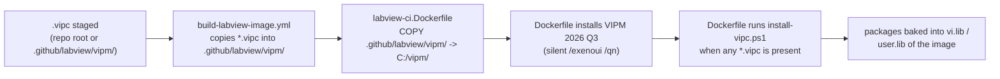

# Baking VIPM (VIPC) dependencies into the Windows CI worker

This folder holds everything the Windows CI worker needs to install **VIPM**
(JKI VI Package Manager) packages into the LabVIEW container image at build time,
so that a project's custom dependencies — declared in a `.vipc` configuration —
are already present when CI jobs (unit tests, VI Analyzer, documentation, …) run.

It exists because some CI operations link against VIPM-distributed libraries that
are **not** part of the bare NI LabVIEW image. The most important example: the
built-in `LabVIEWCLI -OperationName RunUnitTests` operation links against NI's
**UTF JUnit Report** library (`ni_lib_utf_junit_report`). Without it, headless
unit-test runs fail with **LabVIEW CLI error `-350053`** and CI reports a
false "no unit tests found".

---

## Files

| File | Role |
| --- | --- |
| `install-vipc.ps1` | Build-time hook. Finds/installs the VIPM CLI, launches headless LabVIEW, then installs the packages listed in every staged `*.vipc`. A failed bake fails the image build unless `VIPM_ALLOW_MISSING_PACKAGES=1` is explicitly set. |
| `ci-tooling.vipc` | The default CI-tooling configuration (Antidoc CLI, Caraya, VI Tester, UTF JUnit Report). Generated from the two JSON files below. |
| `ci-tooling.packages.json` / `ci-tooling.defaults.json` | Inputs used by `build-tooling-vipc.py` to (re)generate `ci-tooling.vipc`. |
| `build-tooling-vipc.py` | Regenerates `ci-tooling.vipc` from the JSON inputs. |

---

## How a `.vipc` gets baked in (the pipeline)



A repository that "features a `.vipc`" therefore gets that configuration baked
into the Windows worker automatically — the build workflow copies any repo-root
`*.vipc` (e.g. `COTC Dependencies.vipc`) into this folder before building.

To add **custom** project dependencies: commit a `.vipc` (made in the VIPM
editor, or generated like `ci-tooling.vipc`) at the repo root or under
`.github/labview/vipm/`, then rebuild the image. No script changes are needed.

---

## What we learned getting VIPM to run headless in a Windows container

These are the non-obvious requirements. Each one was a distinct failure mode we
hit and fixed; keep them in mind when changing the install path.

### 1. Use VIPM 2026 Q3 (26.3) or newer — not the NI-feed `ni-vipm`

The NI Package Manager feed ships an **older** VIPM (`2026.1.0`) whose CLI cannot
complete a headless package install in a Windows container: its `library_list`
call into LabVIEW times out (~330 s) and the old CLI does **not** surface the
underlying error. The **2026 Q3** build (`26.3.3954`) surfaces underlying install
errors and improves headless/container support.

The Dockerfile now downloads the official installer from the JKI CDN and runs it
silently:

```
https://traffic.libsyn.com/secure/jkinc/vipm-26.3.3954-windows-setup.exe
```

It is a standard InstallShield setup — `/exenoui /qn` runs it fully silent
(per <https://docs.vipm.io/latest/installation/>). Override the URL with the
`VIPM_INSTALLER_URL` build-arg / env var to pin a different version.

### 2. No VIPM Pro license is required — but the current container resolver has a bug

The target path is VIPM Free/Community Edition: no VIPM Pro serial is required or
accepted as a prerequisite for this repo. Pro activation is still attempted
automatically if the optional `VIPM_SERIAL_NUMBER` / `VIPM_FULL_NAME` /
`VIPM_EMAIL` secrets are supplied, but the normal path uses the Free/Community
CLI.

Important current limitation (VIPM 26.3.3954): JKI's public Docker example says
container use currently requires Pro activation and that Free/Community support
is intended but still being fixed. Our tests match that: on a normal desktop
Free install, `vipm refresh --force -v` downloads the NI Tool Network and VIPM
Community indexes plus package specs, and `vipm search` resolves packages. In a
Windows Server Core `docker build`, the same Free/Community refresh reports
success but does not download those indexes/specs, so `vipm install <name>` exits
`3` (`PACKAGE_NOT_FOUND`) for every community package.

To keep CI unblocked without a Pro license, `install-vipc.ps1` keeps the official
path first (`vipm refresh`, `vipm install <file.vipc>`, then by-name installs),
then falls back to a resolver-bypass path when the VIPM index is empty: it
downloads the public repository indexes directly, resolves the VIPC package list
and transitive dependencies, downloads the corresponding `.vip` / `.ogp` package
files, validates ZIP magic and MD5 when the index provides one, and installs
those local files with `vipm install <file>`. This bypasses package *discovery*
only; VIPM still performs the actual LabVIEW package install.

The fallback currently knows the two built-in public repositories:

- NI LabVIEW Tools Network: `http://download.ni.com/evaluation/labview/lvtn/vipm/index.vipr`
- VIPM Community: `http://www.jkisoft.com/packages/jkisoft.ogpd`

It also maps the legacy VIPC alias `jki_vi_tester` to the repository package ID
`jki_labs_tool_vi_tester` and translates old OpenG `sf://opengtoolkit/...`
package URLs to SourceForge download URLs.

**The catch (VIPM 26.3):** Community Edition only installs packages when the
**current working directory is inside a _public_ Git repository**. Run it anywhere
else and every install aborts instantly with exit `6`:

```
error: Not inside a Git repository: no git repository found
VIPM Community Edition requires a public Git repository. Upgrade to VIPM
Professional for use outside of public repositories: https://vipm.io/pro
```

During `docker build` the installs run from `C:\vipm` (just the copied scripts),
which is **not** a Git repo — so they were all blocked. VIPM determines the
repository and its visibility by **shelling out to a real `git` binary** (it runs
`git` to read `.git/config`'s `origin` URL and to confirm the repo is public). It
needs **no clone and no commits**, but it _does_ need a git executable on `PATH`
— without one it fails with a second flavour of exit `6`:

```
error: Cannot determine repository visibility: failed to execute
git: program not found
```

The Windows base image ships **no git**, so the Dockerfile installs full Git for
Windows first and falls back to portable MinGit. `install-vipc.ps1` then prefers a
real shallow clone of the public repository, falls back to a minimal fabricated
`.git` if cloning is unavailable, `cd`s into it, runs the installs, and deletes it
afterward. The repo URL comes from the `VIPM_PUBLIC_REPO_URL` build-arg / env var
(the build workflow passes the actual building repo via
`${{ github.server_url }}/${{ github.repository }}.git`, so a fork uses its own
public repo); it defaults to this repo.

Minimal `.git` that satisfies the check:

```
.git/HEAD      ->  ref: refs/heads/main
.git/config    ->  [remote "origin"]
                       url = https://github.com/<owner>/<public-repo>.git
.git/objects/  (empty)
.git/refs/heads/  (empty)
```

### 3. Run the CLI non-interactively

Set so the CLI never blocks waiting for a prompt and emits clean logs:

- `VIPM_NONINTERACTIVE=1` — auto-confirm; error (don't hang) on missing params.
- `VIPM_ASSUME_YES=1` — explicit "yes" to confirmations.
- `NO_COLOR=1` — no ANSI color codes in CI logs.

### 4. VIPM needs `Settings.ini`

`vipm install` reads `C:\ProgramData\JKI\VIPM\Settings.ini` for its target
LabVIEW configuration and aborts with *"IO error: Failed to load …Settings.ini …
(os error 2)"* if it is missing. A fresh image that never launched VIPM
interactively won't have it, so `install-vipc.ps1` **seeds a minimal
`Settings.ini`** (target name/version/location/VI-Server port `3363`) when it is
absent. The proper installer may also create it; the seed only writes if missing.

### 5. LabVIEW must be running headless before `vipm install`

The modern CLI installs packages **into a running LabVIEW** over VI Server. The
script launches LabVIEW with `--headless` (works on Windows and Linux) and waits
for the VI Server port (`3363`) to accept connections before installing, then
stops it afterward. Without this, the install has nothing to install into.

### 6. Mind the operation timeouts during `docker build`

VIPM auto-detects CI environments (`GITHUB_ACTIONS`, `CI`, …) and uses **longer**
default timeouts there. **But during `docker build` those env vars are not
present**, so VIPM falls back to its **short** defaults
(`check_for_updates` ~270 s, `library_list` ~330 s), which can abort a cold,
first-run headless LabVIEW before it finishes responding.

Fix: set **`VIPM_TIMEOUT`** (seconds) to override the default/CI-adjusted
timeout. The script sets `VIPM_TIMEOUT=900`. See
<https://docs.vipm.io/latest/cli/environment-variables/>.

### 7. CLI command shape (26.3 Rust/clap CLI)

Verified against `vipm install --help` and the
<https://docs.vipm.io/latest/cli/command-reference/> reference. **The 26.3 CLI
changed shape vs. the older `2026.1.0` build — mind the differences:**

- Install by name with a pinned version using **`@`**:
  `vipm install ni_lib_utf_junit_report@1.0.1.43`
  (the hyphen form `pkg-1.2.3.4` is misread as a file path).
- **Global** options (place them **before** the `install` subcommand):
  `--labview-version <YYYY>`, `--labview-bitness <32|64>`, `--timeout <SECONDS>`,
  `--json`, `--color-mode auto|always|never`, `-v/--verbose`. They are accepted
  on every command; the script calls
  `vipm --labview-version 2026 --labview-bitness 64 install <pkgs>`.
- **`--refresh` was removed** from `install` (it existed as a global option on
  `2026.1.0`). 26.3 refreshes the package list with a **separate**
  `vipm refresh` command, which the script runs once before installing. Passing
  `--refresh` to `install` now fails with exit `2` (`COMMAND_SYNTAX_ERROR`:
  *"unexpected argument '--refresh' found"*).
- `-y` / `--yes` **does** exist in 26.3 (skips the confirm prompt when installing
  **from a file**), but the script relies on the `VIPM_NONINTERACTIVE` /
  `VIPM_ASSUME_YES` env vars instead, so it isn't needed.
- The `config.xml`-only `.vipc` produced by `build-tooling-vipc.py` is **not**
  reliably accepted by `vipm install <file.vipc>` directly, so the script parses
  the package names out of the `.vipc` and installs each **by name**.

---

## Environment variables (read by `install-vipc.ps1` / the Dockerfile)

| Variable | Default | Purpose |
| --- | --- | --- |
| `VIPM_INSTALLER_URL` | `…/vipm-26.3.3954-windows-setup.exe` | VIPM installer to download if the CLI isn't already present. |
| `VIPM_COMMUNITY_EDITION` | _(unset)_ | Optional override. Do not force it unless you specifically need to exercise the Community public-repo entitlement gate. |
| `VIPM_NONINTERACTIVE` | `1` | Never block on prompts. |
| `VIPM_ASSUME_YES` | `1` | Auto-confirm. |
| `VIPM_TIMEOUT` | `900` | Override the per-operation timeout (seconds). |
| `VIPM_PUBLIC_REPO_URL` | this repo's clone URL | Public Git repo `origin` used to satisfy Community Edition's public-repo requirement. |
| `VIPM_ALLOW_MISSING_PACKAGES` | _(unset)_ | Set to `1` only for emergency best-effort builds; otherwise a failed VIPM bake fails the image build. |
| `GIT_INSTALLER_URL` | Git for Windows 2.54.0 installer | Full Git for Windows installer used before the MinGit fallback. |
| `NO_COLOR` | `1` | Strip ANSI color from logs. |
| `LABVIEW_VERSION` | `2026` | Target LabVIEW year for `--labview-version`. |
| `LABVIEW_BITNESS` | `64` | Target LabVIEW bitness for `--labview-bitness`. |
| `VIPM_SERIAL_NUMBER` / `VIPM_FULL_NAME` / `VIPM_EMAIL` | _(unset)_ | Optional VIPM Pro activation. |

---

## Troubleshooting

| Symptom in the build/CI log | Likely cause / fix |
| --- | --- |
| `LabVIEW CLI error -350053` during RunUnitTests | UTF JUnit Report library not baked in — VIPM install was skipped or failed. Check this hook's log. |
| `VIPM Community Edition requires a public Git repository` (exit 6) | The install ran outside a public Git repo. The script runs installs from a fabricated `.git` whose `origin` is `VIPM_PUBLIC_REPO_URL`; make sure that points at a real **public** repo. |
| `Cannot determine repository visibility: … git: program not found` (exit 6) | No git binary on `PATH`. VIPM shells out to `git` to verify the repo is public. The Dockerfile bakes portable MinGit into `C:\git`; check the "Downloading portable Git" step succeeded (`GIT_INSTALLER_URL`). |
| `IO error: Failed to load …Settings.ini … (os error 2)` | VIPM `Settings.ini` missing — the script's seed step didn't run (no LabVIEW found?). |
| `Operation 'VIPM command 'library_list'' timed out after 330s` | Short build-time timeout and/or an old CLI. Use VIPM 26.3+ and raise `VIPM_TIMEOUT`. |
| `error: unexpected argument '--refresh' found` (exit 2) | 26.3 removed `--refresh` from `install`. Run the standalone `vipm refresh` first; don't pass `--refresh` to `install`. |
| `error: unexpected argument '--labview-version' found` (exit 2) | Global options must go **before** the `install` subcommand: `vipm --labview-version 2026 install <pkgs>`. The script also falls back to the bare form (active target from `Settings.ini`). |
| Package install reports "not found" | In Free/Community Windows containers this usually means VIPM's resolver index is empty even after `refresh`. The script falls back to direct public-index `.vip` / `.ogp` downloads and local-file installs; if that also fails, check package URLs, MD5s, and whether the package is in a custom/private repo. |

---

## References

- VIPM CLI docs: <https://docs.vipm.io/latest/cli/>
- Environment variables: <https://docs.vipm.io/latest/cli/environment-variables/>
- Docker / containers: <https://docs.vipm.io/latest/cli/docker/>
- GitHub Actions / CI: <https://docs.vipm.io/latest/cli/github-actions/>
- Installation (Windows installer URLs): <https://docs.vipm.io/latest/installation/>
- Headless LabVIEW: <https://github.com/ni/labview-for-containers/blob/main/docs/headless-labview.md>
